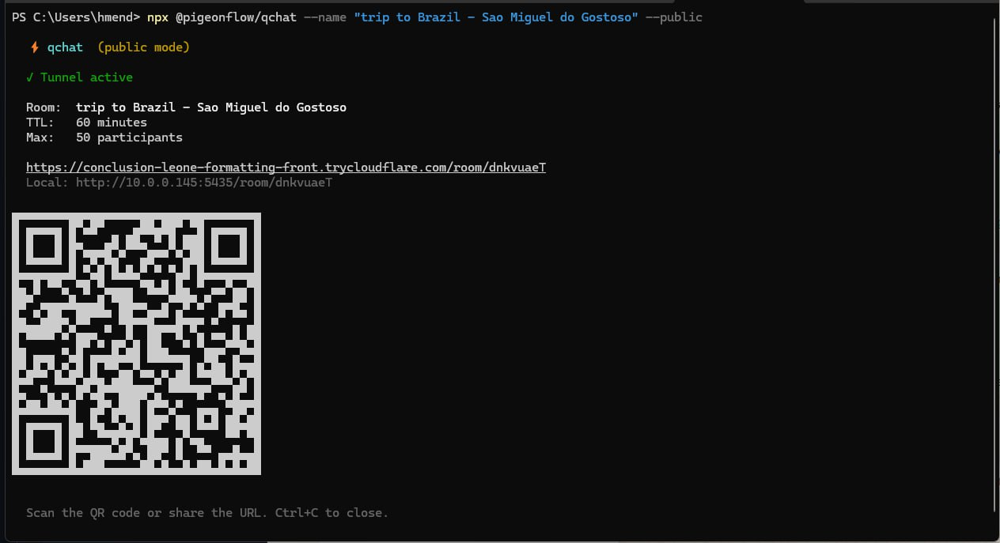

# qchat



Disposable group chat. One command, one QR code, zero signup.

Spin up an instant chat room from your terminal. Share the QR code — people scan it and join from their phone browser. No app to install. Room self-destructs when done.

## Install

```bash
npx @pigeonflow/qchat
```

That's it. No global install needed.

## Usage

```bash
# Start a local chat room (default: 60 min TTL)
npx @pigeonflow/qchat

# Public mode — accessible from anywhere via Cloudflare tunnel
npx @pigeonflow/qchat --public

# Custom room name
npx @pigeonflow/qchat --name "Team Standup"

# Persist mode — room stays open until everyone leaves
npx @pigeonflow/qchat --persist

# Password-protected room
npx @pigeonflow/qchat --password secret123

# Custom TTL (30 minutes)
npx @pigeonflow/qchat --ttl 30

# Combine flags
npx @pigeonflow/qchat --public --name "Workshop" --persist --password demo
```

## Options

| Flag | Description | Default |
|------|-------------|---------|
| `-p, --port <n>` | Port to serve on | Random (3000-9000) |
| `-t, --ttl <min>` | Room expires after N minutes | `60` |
| `-n, --name <s>` | Room display name | `Chat Room` |
| `-m, --max <n>` | Max participants | `50` |
| `--password <s>` | Require password to join | None |
| `--public` | Expose via Cloudflare tunnel | Off |
| `--persist` | No TTL — room lives until empty | Off |
| `--bot [name]` | Add an AI agent to the chat | Off |
| `--bot-agent <id>` | OpenClaw agent id for `--bot` | `main` |
| `--bot-greeting <s>` | Custom bot greeting message | Auto |

## How it works

1. You run `npx @pigeonflow/qchat` on your machine
2. A QR code appears in your terminal
3. People scan it → opens a chat in their phone browser
4. Real-time messaging via WebSocket
5. Room auto-expires after TTL (or when everyone leaves in persist mode)
6. `Ctrl+C` closes everything

### Public mode

By default, qchat runs on your local network. Add `--public` to make it accessible from anywhere:

```bash
npx @pigeonflow/qchat --public
```

This starts a [Cloudflare tunnel](https://developers.cloudflare.com/cloudflare-one/connections/connect-networks/) — your room gets a public HTTPS URL like `https://random-words.trycloudflare.com/room/abc123`. First run downloads the `cloudflared` binary (~25MB, cached at `~/.qchat/bin/`).

### Add to Home Screen

The chat UI is a PWA. Users can tap "📲 Add to Home" in the header to save it as an app shortcut on their phone — instant access without opening a browser.

## AI Agent Mode

Add an [OpenClaw](https://github.com/openclaw/openclaw) agent as a chat participant. The agent joins the room, sees all messages, and responds when @mentioned.

```bash
# Add your default agent to the chat
npx @pigeonflow/qchat --bot Snoopy

# Public room with a named agent
npx @pigeonflow/qchat --public --persist --bot Snoopy

# Target a specific agent
npx @pigeonflow/qchat --bot Assistant --bot-agent ops

# Custom greeting
npx @pigeonflow/qchat --bot Snoopy --bot-greeting "Hey team! Ask me anything."
```

### How it works

1. The bot joins as a regular participant with the name you provide
2. It announces itself on join with a greeting message
3. It sees all messages for context but **only responds when @mentioned**
4. Type `@` in the input to autocomplete participant names
5. Mentions are highlighted in chat bubbles

### Requirements

- [OpenClaw](https://github.com/openclaw/openclaw) must be installed and running on the host machine
- The agent responds via `openclaw agent --json` under the hood
- Typing indicator shows while the agent is thinking (~3-10s depending on model)

### Use cases

- **Live demos** — QR on a slide, audience chats with your agent
- **Support kiosk** — print a QR code, customers scan and get instant AI help
- **Group + AI** — team brainstorm with an AI participant for research/ideas
- **Workshops** — AI tutor in a group chat, students ask questions via @mention

## Use cases

- **Meetings** — quick throwaway chat for a standup or call
- **Workshops** — audience Q&A without installing anything
- **Events** — conference hallway chat, party coordination
- **Classrooms** — real-time backchannel
- **LAN parties** — local network, no internet needed

## Features

- 📱 WhatsApp-style mobile-first UI (dark theme)
- 🔒 Optional password protection
- ⏱️ Configurable TTL or persist-until-empty mode
- 🌐 Public mode via Cloudflare tunnel
- 📲 PWA — installable as home screen shortcut
- 💬 Typing indicators, read ticks, color-coded names
- 🔄 Device ID tracking (reconnect handling, name memory)
- 📷 QR code in terminal + shareable SVG endpoint
- 🤖 AI agent mode — add an OpenClaw agent as a participant
- @️ @mention autocomplete + highlighting

## License

MIT

## Links

- [npm](https://www.npmjs.com/package/@pigeonflow/qchat)
- [GitHub](https://github.com/pigeonflow/qchat)
